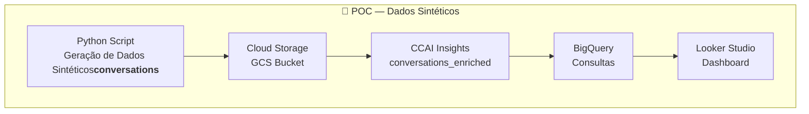
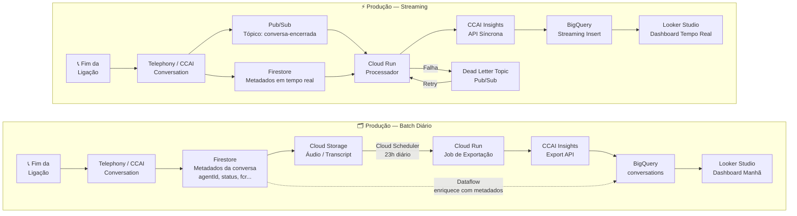
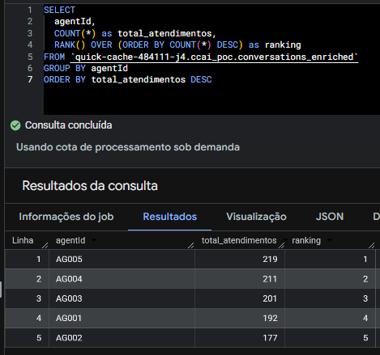

# poc-gcp-ccai

## Contexto

Esta POC foi construída para demonstrar como o **Contact Center AI Insights (CCAI)**, integrado ao **BigQuery** e ao **Looker Studio**, pode responder de forma objetiva às principais perguntas de uma operação de atendimento.

As 6 perguntas de negócio cobertas foram:

1. **Produtividade por agente**  
   Quem são os agentes mais produtivos em volume de atendimentos?

2. **Distribuição de tickets por status**  
   Quantos atendimentos estão resolvidos, pendentes, abertos ou escalados?

3. **Taxa de FCR (First Call Resolution)**  
   Qual percentual de atendimentos é resolvido no primeiro contato?

4. **TMA (Tempo Médio de Atendimento)**  
   Qual o TMA por agente e por tipo de ticket?

5. **Tempo médio de espera na fila**  
   Quanto tempo, em média, o cliente espera na fila antes de ser atendido?

6. **Taxa de abandono**  
   Quantos clientes desistem antes de serem atendidos e qual a taxa de abandono?

---

## Fluxos de arquitetura — POC, streaming e Batch

O primeiro diagrama abaixo, mostra como foi construida a solução (POC):



A seguir a arquitetura simplificada que simula o cenário real em streaming e batch:



---

## O que cada ferramenta faz em cada cenário

| Ferramenta | POC (Sintéticos) | Batch (Diário) | Streaming |
|---|---|---|---|
| **Python Script** | Gera 1.000 conversas e metadados simulados, enriquece a tabela no BQ | Não usado | Não usado |
| **Cloud Storage (GCS)** | Armazena as conversas sintéticas para envio ao CCAI | Recebe áudios e transcrições acumulados durante o dia | Não usado |
| **CCAI Insights** | Import API para ingestão + análise NLP das conversas sintéticas | Export API processa o lote diário de conversas | API síncrona analisa 1 conversa por vez ao encerrar |
| **Firestore** | Não usado | Salva metadados em tempo real durante o atendimento (agentId, status, fcr...) | Salva metadados em tempo real e os entrega ao Cloud Run para enriquecer a conversa |
| **Cloud Scheduler** | Não usado | Dispara o job de exportação todo dia às 23h automaticamente | Não usado |
| **Cloud Run** | Executa o script Python de enriquecimento da tabela | Executa o job noturno de exportação do CCAI para o BQ | Processa mensagens do Pub/Sub e chama a API do CCAI |
| **Pub/Sub** | Não usado | Não usado | Recebe o evento de conversa encerrada via webhook e enfileira para processamento |
| **Dataflow** | Não usado | Combina metadados do Firestore com dados do CCAI antes de gravar no BQ | Não usado |
| **BigQuery** | Recebe tabela `conversations_enriched` com campos nativos + metadados simulados | Recebe tabela `conversations` via Export API + Dataflow | Recebe linha a linha via Streaming Insert em tempo real |
| **Looker Studio** | Dashboard estático conectado à tabela enriquecida | Dashboard atualizado uma vez por dia (manhã) | Dashboard em tempo real, atualizado segundos após cada conversa |

---

## Dados gerados em Python

Nesta POC trabalhamos com **1.000 conversas sintéticas** em formato CHAT, criando a tabela `conversations`, alguns dos campos simulados foram:

- **Agentes simulados** (`agentId`)
  - Valores: `AG001`, `AG002`, `AG003`, `AG004`, `AG005`
  - Usados para avaliar produtividade por agente e TMA individual

- **Status de atendimento** (`status`)
  - Valores: `resolvido`, `pendente`, `aberto`, `escalado`
  - Distribuição: 55% resolvido, 20% pendente, 15% aberto, 10% escalado

- **Tipo de ticket** (`ticket_type`)
  - Valores: `suporte_tecnico`, `cobranca`, `cancelamento`, `informacao`

- **Indicador FCR** (`fcr`)
  - Booleano: `TRUE` = resolvido no primeiro contato
  - Probabilidade de 72% de FCR verdadeiro

- **Tempo de atendimento** (`handle_time_sec`)
  - Derivado de `durationNanos` convertido para segundos

- **Tempo de espera na fila** (`queue_time_sec`)
  - Valor inteiro aleatório entre 30 e 480 segundos

- **Abandono** (`abandoned`)
  - Booleano com 8% de probabilidade de abandono

- **Sentimento simulado** (`sentiment`)
  - Float entre aproximadamente -0.3 e 0.9

---

## Papéis do CCAI

A `conversations_enriched` foi criada a partir da tabela exportada pelo CCAI, para simular uma operação real de contact center. Cada conversa representa um atendimento entre um cliente e um agente.

O CCAI gerou, para cada conversa, os seguintes campos nativos:

- `conversationName` — ID único da conversa
- `medium` — formato da conversa ("CHAT")
- `languageCode` — idioma detectado ("pt-BR")
- `turnCount` — número de turnos da conversa
- `durationNanos` — duração total em nanossegundos
- `silencePercentage` — percentual de silêncio
- `agentSentimentScore`, `clientSentimentScore` — sentimento de cada parte
- `issues`, `entities`, `sentences`, `words` — análise de NLP (processamento de linguagem natural)

---

## Queries do BigQuery

Todas as queries foram executadas sobre a tabela:

```sql
ccai_poc.conversations_enriched
```

### 1. Produtividade por agente

```sql
SELECT
  agentId,
  COUNT(*) as total_atendimentos,
  RANK() OVER (ORDER BY COUNT(*) DESC) as ranking
FROM `quick-cache-484111-j4.ccai_poc.conversations_enriched`
GROUP BY agentId
ORDER BY total_atendimentos DESC
```

**O que faz:** Agrupa as conversas por agente, conta os atendimentos de cada um e aplica `RANK()` para gerar o ranking do mais ao menos produtivo. Útil para identificar desequilíbrio de carga entre agentes.

<br/>
Exemplo de consulta:
<p align="center">  </p>
<br/>

---

### 2. Tickets por status

```sql
SELECT
  status,
  COUNT(*) as total,
  ROUND(COUNT(*) * 100.0 / 1000, 1) as percentual
FROM `quick-cache-484111-j4.ccai_poc.conversations_enriched`
GROUP BY status
ORDER BY total DESC
```

**O que faz:** Agrupa por `status` e calcula o percentual de cada categoria em relação ao total. Mostra a distribuição do backlog e quantos casos ainda precisam de ação.

---

### 3. Taxa FCR

```sql
SELECT
  COUNTIF(fcr = TRUE) as resolvidos_1o_contato,
  COUNT(*) as total,
  ROUND(COUNTIF(fcr = TRUE) * 100.0 / COUNT(*), 1) as fcr_percentual
FROM `quick-cache-484111-j4.ccai_poc.conversations_enriched`
```

**O que faz:** Conta quantos atendimentos tiveram `fcr = TRUE` e divide pelo total para obter o percentual. O FCR é o principal indicador de qualidade de uma operação de atendimento.

---

### 4. TMA por agente e tipo de ticket

```sql
SELECT
  agentId,
  ticket_type,
  ROUND(AVG(handle_time_sec) / 60, 1) as tma_minutos,
  COUNT(*) as total_atendimentos
FROM `quick-cache-484111-j4.ccai_poc.conversations_enriched`
WHERE abandoned = FALSE
GROUP BY agentId, ticket_type
ORDER BY agentId, tma_minutos DESC
```

**O que faz:** Exclui conversas abandonadas (`abandoned = FALSE`) e calcula a média de `handle_time_sec` por agente e tipo de ticket, convertida para minutos. Permite identificar quais combinações de agente e demanda consomem mais tempo.

---

### 5. Tempo médio de espera na fila

```sql
SELECT
  ROUND(AVG(queue_time_sec), 0) as espera_media_seg,
  ROUND(AVG(queue_time_sec) / 60, 1) as espera_media_min,
  MAX(queue_time_sec) as espera_maxima_seg,
  MIN(queue_time_sec) as espera_minima_seg
FROM `quick-cache-484111-j4.ccai_poc.conversations_enriched`
```

**O que faz:** Calcula média, máximo e mínimo do tempo de fila. Serve como base para discussões de SLA, dimensionamento de equipe e correlação com a taxa de abandono.

---

### 6. Taxa de abandono

```sql
SELECT
  COUNTIF(abandoned = TRUE) as abandonados,
  COUNT(*) as total_fila,
  ROUND(COUNTIF(abandoned = TRUE) * 100.0 / COUNT(*), 1) as taxa_abandono_percentual
FROM `quick-cache-484111-j4.ccai_poc.conversations_enriched`
```

**O que faz:** Conta os atendimentos marcados como `abandoned = TRUE` e calcula o percentual sobre o total. Taxa elevada indica fila longa ou tempo de espera excessivo — diretamente relacionada com a Query 5.

---

## Conclusões

A partir das queries executadas, obtivemos os seguintes resultados:

### Produtividade por agente
- AG005 liderou em volume de atendimentos com **219 conversas**
- AG002 ficou na última posição com **177 conversas**
- A diferença entre o topo e a base foi de **42 atendimentos (~20%)**, dentro de uma variação aceitável para distribuição aleatória

### Distribuição de tickets por status
- **56,5%** dos atendimentos foram resolvidos
- **43,5%** ainda demandam alguma ação (pendente, aberto ou escalado)
- Escalados representam **9,2%** — indicador de complexidade que merece acompanhamento

### Taxa FCR
- **732 de 1.000** atendimentos resolvidos no primeiro contato
- Taxa FCR de **73,2%** — dentro do benchmark de mercado (70–75%)

### TMA por agente e tipo
- TMA médio de **~2 minutos** para todos os agentes e tipos
- AG005 apresentou o melhor resultado em suporte técnico (**1,9 min**)
- Baixa variação entre agentes indica dados simulados — em produção os valores tenderão a variar mais

### Tempo médio de espera
- Espera média de **4,3 minutos** (257 segundos)
- Espera máxima de **8 minutos** e mínima de **31 segundos**
- O benchmark recomendado é abaixo de 3 minutos — ponto de atenção para o cliente

### Taxa de abandono
- **80 abandonos** em 1.000 atendimentos
- Taxa de **8,0%** — acima da referência de mercado de 5%
- Correlação direta com o tempo médio de espera de 4,3 minutos: reduzir a fila tende a reduzir o abandono

---

## Dashboard (Looker Studio)

**Link para os dashs com as perguntas devidamente respondidas**  

- https://lookerstudio.google.com/reporting/957cf4bb-7bab-452d-a207-4afef9c25df8

